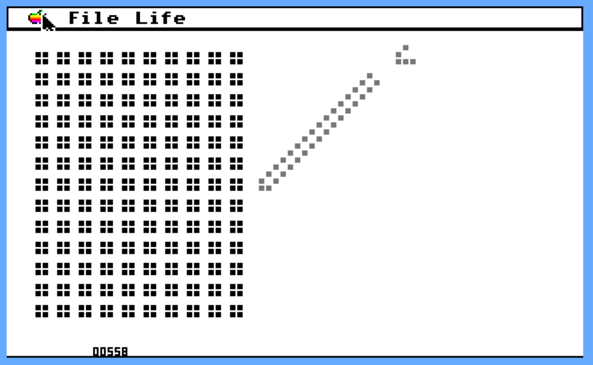

# Liphe.816

This program implements John Conway's "Game of Life" for an Apple IIgs running GS/OS.

This is one of the very first Apple IIgs 16-bit programs I ever wrote. 

Briefly, Life is a simulation of cellular automata - each "cell" has a very short set of rules that govern its next state based on its current state and the state of neighboring cells.

https://en.wikipedia.org/wiki/Conway%27s_Game_of_Life



## Distribution

The 'Makefile' in the project root is for building the github distribution and Release files, not for building Liphe.816.

1. There are the source files - for your perusal
1. There is a SHK with the source and executable
1. And there is a PO with the source and executable

## Building

To build, you will need the ORCA/M assembler for Apple IIgs, and GNO/ME. It would be best to use the PO or the SHK so you don't have to set the file types. Or you can, you know, if you're in to that.

```
cd src/life.build/
make
```

You can probably discern the build instructions by reading the src/life.build/makefile, to build under environments other than GNO/ME.

If you just want to play, download the SHK or PO and the executable is pre-built in there: called Liphe.816.

There are some existing setups in the folder "Setups" that you can Open and run.

Hope you enjoy!
